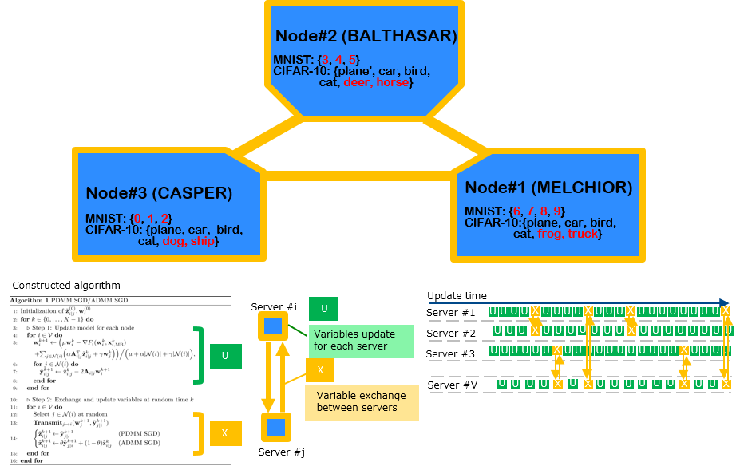
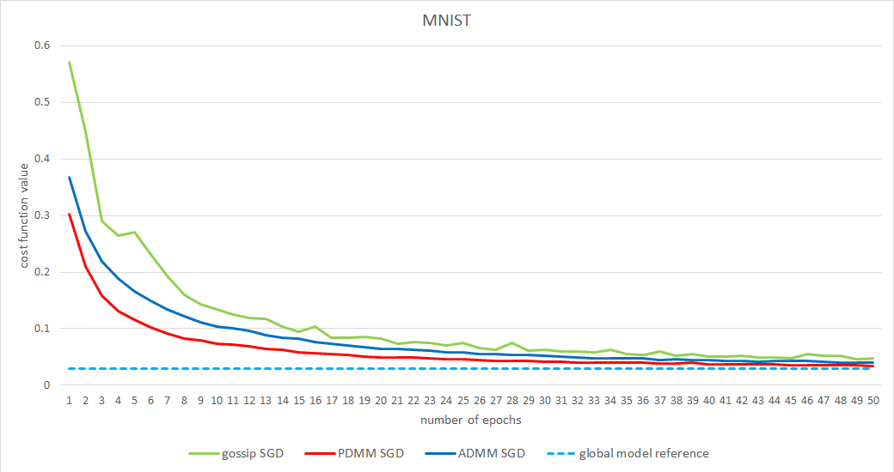
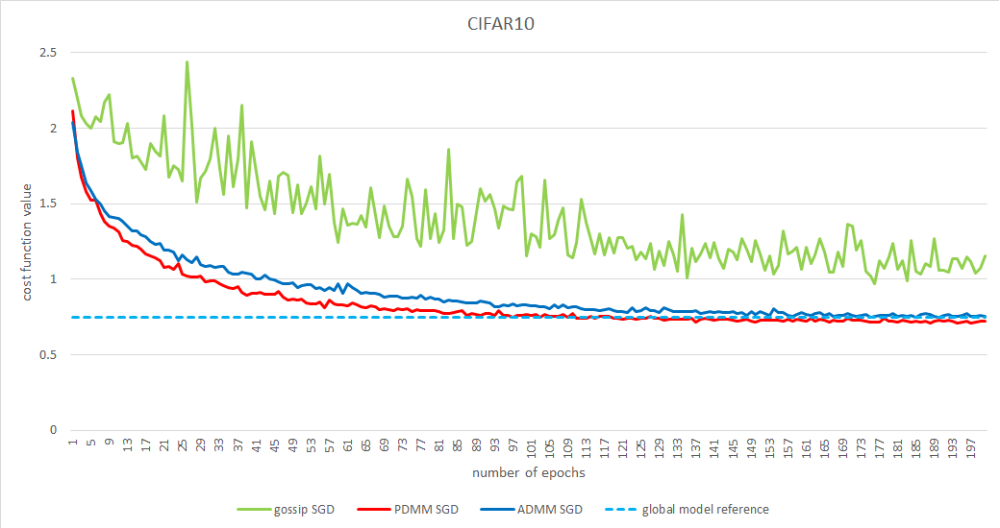
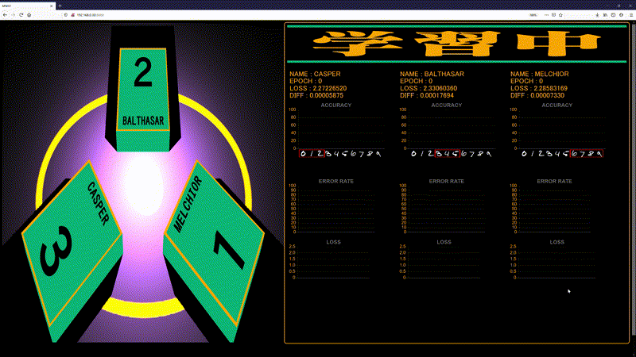

# Update
24th, Aug, 2020: Upload the first version

# Goal
Our study __"edge-consensus learning"__ is an effective deep neural network (DNN) optimization algorithm that can use decentralized datasets over a peer-to-peer (P2P) network. Its details are explained in the following paper:

__Title: "Edge-consensus Learning: Deep Learning on P2P Networks with Nonhomogeneous Data"  
Authors: Kenta Niwa (NTT), Noboru Harada (NTT), Guoqiang Zhang (University Technology of Sydney), and W. Bastiaan Kleijn (Victoria University of Wellington)  
Conference: Proceedings of the 26th ACM SIGKDD International Conference on Knowledge Discovery & Data Mining (KDD 2020)__

https://dl.acm.org/doi/pdf/10.1145/3394486.3403109

Compared with such conventional algorithms as gossip SGD, our method is robust to further practical situations where the data are statistically heterogeneous across the nodes and/or where communication is asynchronous. This is because our variable update rule is derived from node-cost-sum minimization while satisfying a linear constraint so that the model variable for each node is identical.

To verify the effectiveness of our method, we prepared a sample code that runs on GPU/GPUs machines. Edge-consensus learning is composed of (i) PDMMSGD and (ii) ADMM SGD. Note that the original code used in the KDD paper was written in Matlab and developed by Kenta Niwa; code is written in PyTorch and developed by [Masahiko Hashimoto](https://github.com/hashimom).


# License
Carefully read the license file before installing our software. The following paper must be cited when publishing an article that adopts or improves our software:

__Title: "Edge-consensus Learning: Deep Learning on P2P Networks with Nonhomogeneous Data"  
Authors: Kenta Niwa (NTT), Noboru Harada (NTT), Guoqiang Zhang (University Technology of Sydney), and W. Bastiaan Kleijn (Victoria University of Wellington)  
Conference: Proceedings of the 26th ACM SIGKDD International Conference on Knowledge Discovery & Data Mining (KDD 2020)__

After checking the license file, start the installation by following the guide.

## Installation
### On Linux
```shell script
pip install -r requirements.txt
python setup.py install
```

### On Windows  
On Windows, first install PyTorch using the following pages as a guide:
https://pytorch.org/

After that, the procedure is identical as for Linux.
```commandline
pip install -r requirements.txt
python setup.py install
```

## Setup files
Modify the following configuration files before running:

* Node list file
* Node config file (MELCHIOR.json, BALTHASAR.json, CASPER.json)

### 1. Node list file
The node list file contains the network information (address and port number) of the nodes and the nodes to be connected.

Under **"nodes"**, include the information for each node as follows:

Refer to **node_list.json** as a sample.  

| key | value |
| ---- | ---- |
| name | Unique node name |
| addr | IP address |
| port | IP port number |
| edges | (list) Connected nodes |

### 2. Node config file
The node config file contains the required parameters and the devices used in learning.

Refer to **MELCHIOR.json, BALTHASAR.json, CASPER.json** as a sample.  

| key | value |
| ---- | ---- |
| name | Unique node name |
| interval | Interval to swap variables between nodes |
| offset | Offset of the parameter interval to swap |
| device | Device used. e.g., "cuda", "cuda:0" |

## Training
The following two samples are provided as examples:

* run_mnist.py
* run_cifar10.py

### 1. MNIST
To train MNIST, enter the following command:

```shell script
eclmnist -n (Node list file) -c (Node config file) -a (algorithm)
```

example:
```shell script
eclmnist -n node_list.json -c MELCHIOR.json -a pdmm
```

Use the parameter "-a" to set the algorithm type, as shown below.

* "pdmm" : PDMM SGD (default)
* "admm" : ADMM SGD
* "gossip" : gossip SGD

### 2. CIFAR-10
To train CIFAR10, enter the following command:

```shell script
eclcifar10 -n (Node list file) -c (Node config file) -a (algorithm)
```

example:
```shell script
eclcifar10 -n node_list.json -c BALTHASAR.json -a admm
```

## Experimental result using sample source code
Several experimental results using sample source code are briefly explained. In the prepared sample source code, three nodes are fully connected with each other. The communication frequency among the nodes is "interval=6," which indicates that each node pair will randomly communicate once per around six updates for each node. In addition, nonhomogeneous data subsets are set for each node. As shown in the following figure, MNIST/CIFAR-10 data sets are nonhomogeneously distributed for each node, i.e., several data classes are not held on identified node. 

# 

For stable convergence, the following parameters must be set appropriately {mu, eta, rho}. "mu" is the inverse number of the step-size, i.e., around 500-1000 would be appropriate. "eta" should be a relatively large number when making a consensus between nodes seems to be difficult. However, if "eta" is too large, the convergence speed will be significantly decreased. Although "eta" must be set carefully, "rho" is just set for further stable convergence and works well even if it is very small number around 0.0-0.1.

Next the convergence curves are plotted. Four lines are drawn: (i) conventional gossip SGD (green), (ii) proposed PDMM SGD (red), (iii) proposed ADMM SGD (blue), and (iv) global model reference (cyan). For method (i)-(iii), loss function value for V(=3) nodes are calculated using test data sets and averaged. For global model reference, all the training data are aggregated in one place, and the model is also trained in just one place, i.e., this is not a result of distributed situation. The cost function value after 200 epochs (1 epoch = 100 iterations for each node) training is plotted as horizontal dot line. The aim of this experiment is to reach/exceed this value even if data subsets are distributed. With conventional gossip SGD, the convergence behavior is unstable because it runs under asynchronous node communication with nonhomogeneous data subsets. With our proposed edge-consensus learning (PDMM SGD/ADMM SGD), it runs stably because our algorithms have modified gradient direction such that reaches to the global minimum direction. The performances with our edge-consensus learning (PDMM SGD/ADMM SGD) after 200 epochs almost match/exceed the global model reference. Thus, we conclude that a global model can be obtained when node communication is asynchronous and nonhomogeneous data subsets are placed for each node.

# 

# 

Finally, we introduce an animation w.r.t. how convergence behaves using MNIST data sets. Note that the source code to reproduce following GUI is not included. Although each node has different data subsets, i.e., {6-9: node 1, 3-5: node 2, 1-2: node 3}, each node model was updated such that enables to recognize data classes that are not included its own nodes. Convergence speed is not significantly decreased in this setups. 

# 

